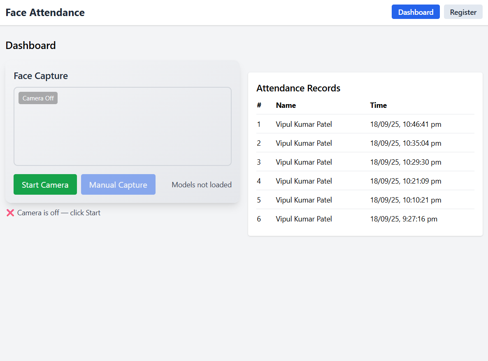
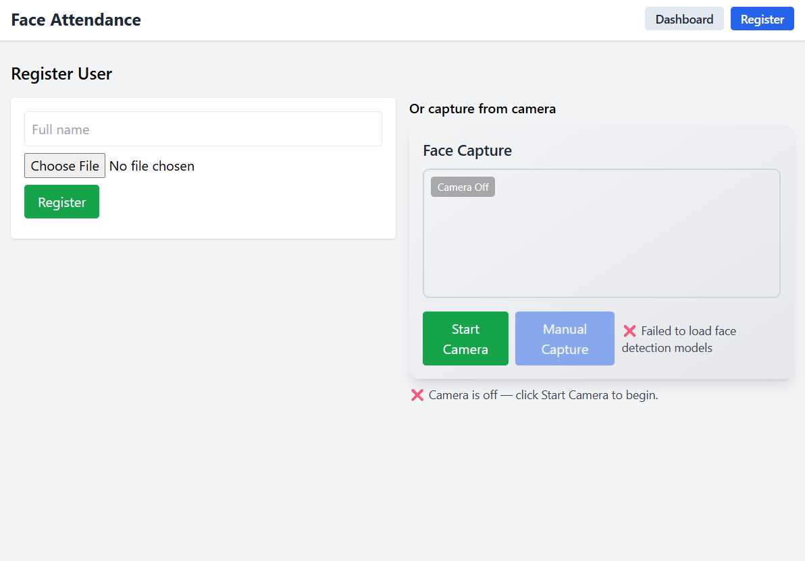

# 📌 Face Detection Attendance System

### 🔹 Overview
A **real-time face recognition attendance system** that automates attendance logging using **ArcFace (InsightFace)** for embeddings, **OpenCV** for image processing, and a **FastAPI backend with MongoDB** for secure data storage.  
Includes a **React.js dashboard** to visualize live attendance records. The system ensures robustness with **anti-spoofing checks** and **duplicate detection**.

---

### 🔹 Features
✅ **Face Registration** – Register new users with their name + face embedding  
✅ **Attendance Marking** – Automatically detects and logs attendance when a face is captured  
✅ **Anti-Spoofing** – Prevents spoofing attempts (flat photos, unrealistic poses, etc.)  
✅ **Duplicate Face Detection** – Uses cosine similarity to avoid duplicate user registrations  
✅ **Dashboard (React.js)** – Live camera feed with real-time attendance updates  
✅ **REST APIs** – Secure FastAPI endpoints for registration, face capture & attendance retrieval  

---

### 🔹 Tech Stack
- **Backend:** Python, FastAPI, Uvicorn, MongoDB, PyMongo  
- **Frontend:** React.js, Axios, Tailwind CSS  
- **Face Recognition:** InsightFace (ArcFace embeddings), OpenCV  
- **Utilities:** NumPy, scikit-learn (cosine similarity), python-multipart, dotenv  

---

---

### 🔹 Demo


---

### 🔹 Screenshots

#### 🖥️ Dashboard Page View  


#### 📷 Register Page View  


---

### 🔹 System Architecture

📸 React.js Frontend (Camera + Dashboard)
    └─ Captures live video feed and displays real-time attendance data

🔗 FastAPI Backend
    └─ Handles REST APIs for registration, face capture, and attendance logging

🧠 Face Recognition Engine (OpenCV + ArcFace)
    └─ Processes frames, extracts embeddings, performs anti-spoofing and duplicate checks

🗄️ MongoDB Database
    └─ Stores user profiles, face embeddings, and attendance records securely
 
---

## ⚙️ Installation & Setup

### 1️⃣ Clone Repository
```bash
git clone https://github.com/Vipul99999/Face-Detection-Attendance-System.git
cd face-attendance-system
```

---

### 2️⃣ Backend Setup (FastAPI + MongoDB)

#### Create Virtual Environment
```bash
cd backend
python -m venv venv
source venv/bin/activate   # Mac/Linux
venv\Scripts\activate      # Windows
```

#### Install Dependencies
```bash
pip install -r requirements.txt
```

#### Start Backend
```bash
uvicorn app.main:app --reload
```

Backend runs at: **[http://localhost:8000](http://localhost:8000)**

---

### 3️⃣ Frontend Setup (React.js + Vite)
```bash
cd frontend
npm install
```

#### Configure `.env` file
```env
VITE_API_BASE_URL=http://localhost:8000/api/v1
VITE_APP_NAME=Face Attendance System
```

#### Start Frontend
```bash
npm run dev
```

Frontend runs at: **[http://localhost:5173](http://localhost:5173)**

---

## 📌 API Endpoints

| Method | Endpoint               | Description                      |
| ------ | ---------------------- | -------------------------------- |
| POST   | `/api/v1/register`     | Register user with name + face   |
| POST   | `/api/v1/capture/auto` | Capture face and mark attendance |
| GET    | `/api/v1/attendance`   | Fetch all attendance records     |

---

## 🧠 How It Works

1. **User Registration** → Capture face → Extract ArcFace embedding → Store in MongoDB.  
2. **Attendance Capture** → Detect face → Extract embedding → Compare with database (cosine similarity).  
3. **Anti-Spoofing** → Rejects flat faces or unrealistic poses.  
4. **Dashboard** → React.js polls backend every few seconds → Displays updated attendance.

---

## 📊 Example Outputs

* ✅ *Successful Attendance:* `{"status": "success", "user": "John Doe", "attendance_marked": true}`  
* ❌ *Spoof Detected:* `{"status": "error", "reason": "Unrealistic head pose"}`  
* ❌ *Duplicate Face:* `{"status": "error", "message": "Face already registered as John Doe"}`

---

## ✅ Future Improvements

* Add **RetinaFace** for better face detection.  
* Store **attendance analytics** (daily, monthly reports).  
* Improve **anti-spoofing with deep learning models**.  
* Deploy on **Docker / Cloud (AWS, GCP, Azure)**.

---

## 👨‍💻 Author

* **Vipul Kumar Patel**  
* 💼 [LinkedIn](https://linkedin.com/in/vipul-kumar-patel-90b1242b1)  
* 📂 [GitHub](https://github.com/Vipul99999)

---

## 📜 License

```text
MIT License

Copyright (c) 2025 [Vipul Kumar Patel]

Permission is hereby granted, free of charge, to any person obtaining a copy...
